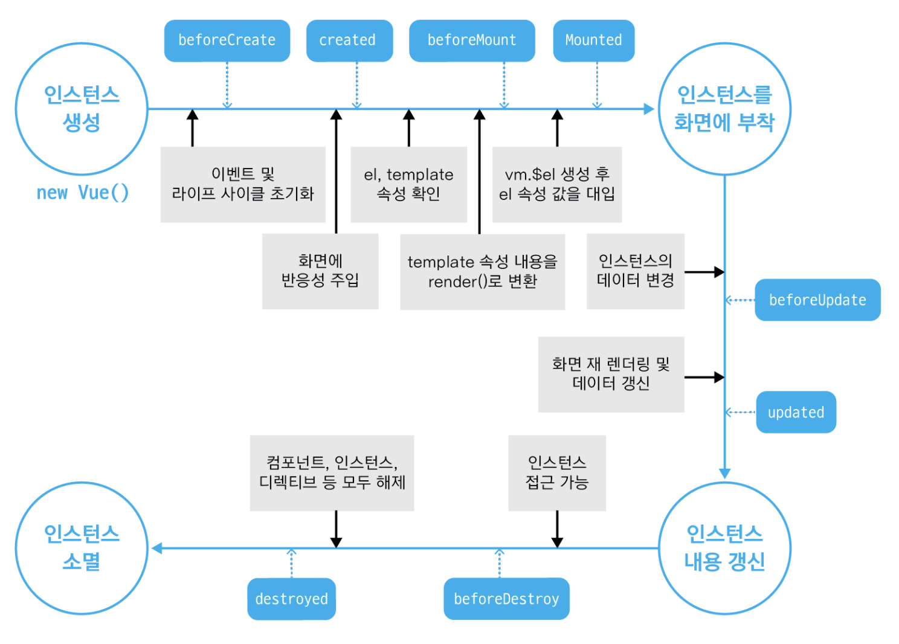
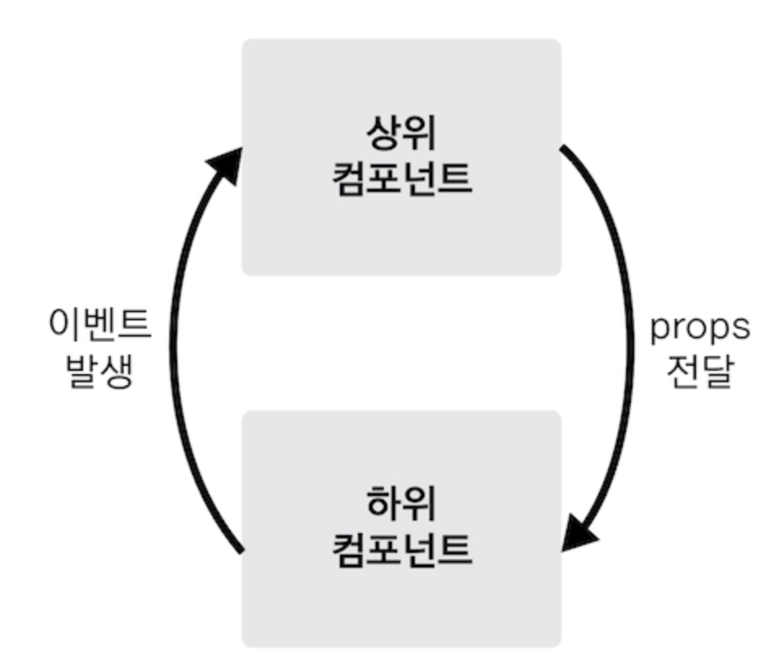
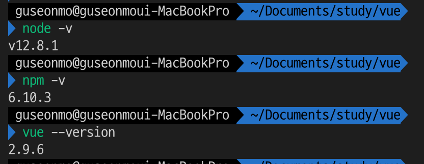
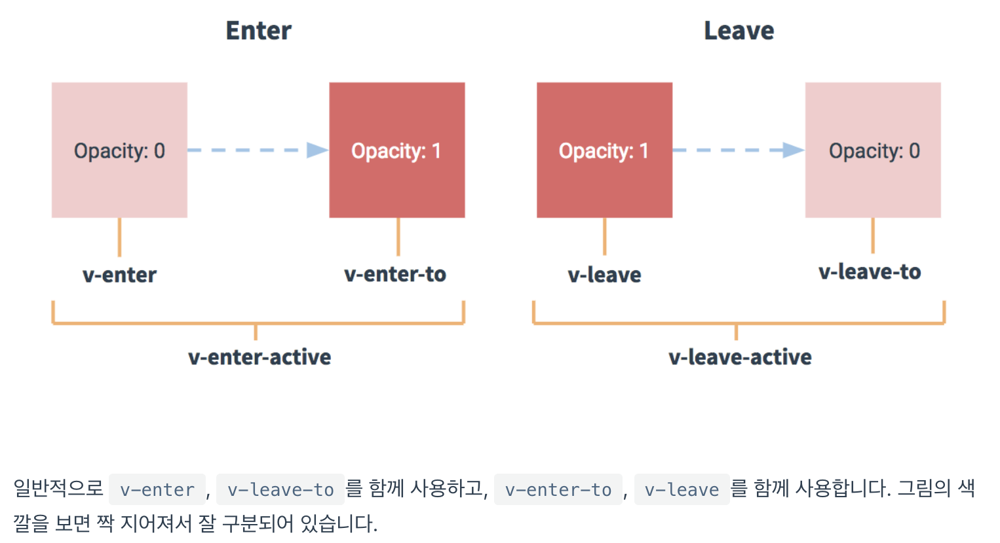
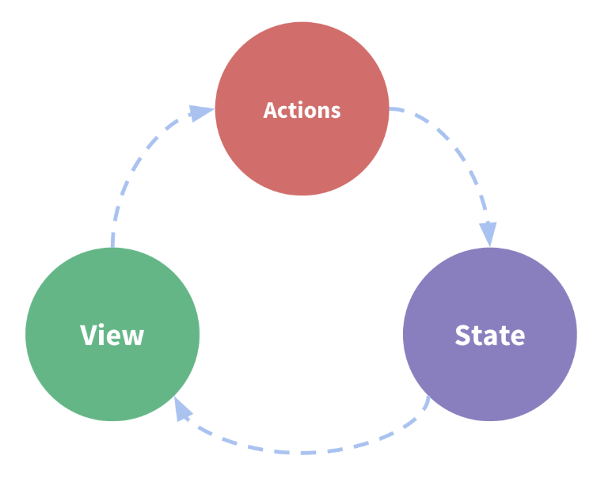
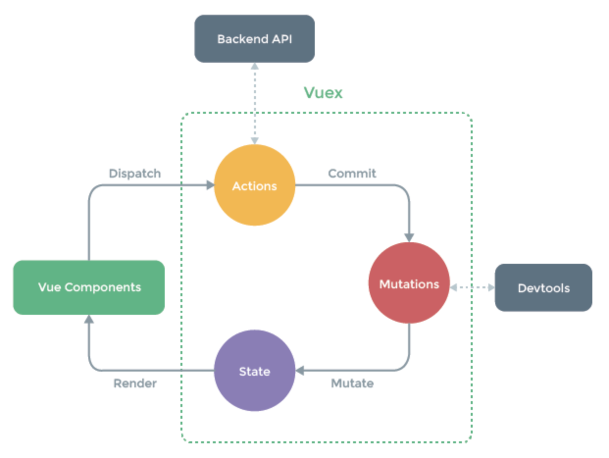

# vue 강의정리

## 기초강의 - vue.js 시작하기 - Age of Vue

vue 오프라인 교육 강의 중 장기효 강사가 인프런 강의 공유해줌.

### Instance

인스턴스의 속성, API들

```js
new Vue({
  el: {...},
  template: {...},
  data: {...},
  methods: {...},
  created: {...},
  watch: {...},
});
```

- el : 인스턴스가 그려지는 화면의 시작점 (특정 HTML 태그)
- template : 화면에 표시할 요소 (HTML, CSS 등)
- data : 뷰의 반응성(Reactivity)가 반영된 데이터 속성
- methods : 화면의 동작과 이벤트 로직을 제어하는 메서드
- created : 뷰의 라이프 사이클과 관련된 속성
- watch : data에서 정의한 속성이 변화했을 때 추가 동작을 수행할 수 있게 정의하는 속성

#### `life cycle`
* 뷰의 라이프 사이클을 이해해야 하는 이유는 바로 라이프 사이클 훅 때문입니다. 
라이프 사이클 훅으로 인스턴스의 특정 시점에 원하는 로직을 구현할 수 있습니다.
* [자주사용하는 life cycle hook](https://vuejs.org/v2/api/#Options-Lifecycle-Hooks)
    * created
    * beforeMount
    * mounted
    * destroyed


### Componant

- 전역컴포넌트 - 전역으로 사용해야하는 plug-in이나 lib 를 사용해야 할때 자주 사용한다.

```js
// Vue.component('컴포넌트 이름','컴포넌트내용');
Vue.component('app-header', {
  template: '<h1>Header</h1>',
});
```

- 지역컴포넌트 - 일반적인 화면에서는 지역컴포넌트를 사용한다.

```js
new Vue({
  el: '#app',
  // 지역컴포넌트
  components: {
    // '컴포넌트 이름','컴포넌트내용'
    'app-footer': {
      template: '<footer>footer</footer>',
    },
  },
});
```

### Component Communication



- props - 상의 컴포넌트의 데이터를 전달한다.
  > 상위컴포넌트의 data 속성의 값을 v-bind를 이용해 하위 컴포넌트로 전달한다. 하위 컴포넌트는 전달받은 값을 props에 정의한 속성값으로 사용가능하다.( {{ propsdata }})

```js
<div id="app">
// <app-header v-bind:프롬스 속성 이름="상위 컴포넌트의 데이터 이름"></app-header>
	<app-header v-bind:propsdata="message"></app-header>
</div>
<script>
	var appHeader =  {
		template: '<h1>{{ propsdata }}</h1>',
		props: ['propsdata']
	};
	new Vue({
		el: '#app',
		components: {
			'app-header': appHeader,
		},
		data: {
			message: 'hi',
			num: 10
		}
	})
</script>
```

- emit - 하위 컴포넌터의 이벤트를 상위컴포넌트로 전달한다.
  > v-on:click="addNumber" 를 통해서 해당컴포넌트의 method를 호출한다.<br>
  > 호출된 method에서 this.\$emit('pass')을 사용해 상위 컴포넌트의 이벤트로 전달한다. (pass 이벤트명)<br>
  > <app-header v-on:하위 컴포넌트에서 발생한 이벤트 이름="상위 컴포넌트의 메서드 이름"></app-header>
  > 상위 컴포넌트 메서드가 전달받아 이벤트를 처리한다.


```js
<div id="app">
// <app-header v-on:하위 컴포넌트에서 발생한 이벤트 이름="상위 컴포넌트의 메서드 이름"></app-header>-->
	<app-content v-on:numincrement="numInc" v-bind:propsdata="num"></app-content>
</div>
<script>
	var appContent = {
		template: '<button v-on:click="addNumber">add - {{ propsdata }}</button>',
		methods: {
			addNumber : function () {
				this.$emit('numincrement');
			}
		},
		props: ['propsdata']
	};

	new Vue({
		el: '#app',
		components: {
			'app-content': appContent
		},
		methods: {
			numInc: function () {
				this.num++;
			}
		},
		data: {
			num: 10
		}
	})
</script>
```

### router

- vue router 생성 및 등록

```js
var loginComponent = {
  template: '<div>login</div>',
};
var mainComponent = {
  template: '<div>main</div>',
};
// 라우터 인스턴드 생성
var router = new VueRouter({
  // 페이지의 라우팅 정보
  routes: [
    {
      // 로그인 페이지 정보
      path: '/login', // 페이지의 url
      component: loginComponent, // 해당 url에서 표시될 컴포넌트
    },
    {
      // 메인페이지 정보
      path: '/main',
      component: mainComponent,
    },
  ],
});

new Vue({
  el: '#app',
  router: router, // 뷰 라우터 인스턴스 등록
});
```

- router-view / router-link
  > router-view : 브라우저의 주소 창에서 URL이 변경되면, 앞에서 정의한 routes path 속성에 따라 해당
      컴포넌트가 화면에 보여a진다. <br>
  router-link : 링크를 클릭해서 화면을 이동해야 할때 사용한다.

```html
<div id="app">
  <div>
    <!-- 링크로 화면이동 -->
    <router-link to="/login">Login</router-link>
    <router-link to="/main">Main</router-link>
  </div>
  <router-view></router-view>
</div>
```

## 중급강의

#### 개발환경 설정

- chrome 브라우저 설치
- [vs code 설치](https://code.visualstudio.com/)
  - plugin 설치 : Vetru, TSLint 설치
- node 설치
  - brew install node
- vue 설치
  - npm install vue
  - npm install -g vue-cli ( npm uninstall -g vue-cli)



#### vue project 생성 및 실행

1. vue init webpack-simple vue-todo : vue-todo 프로젝트 생성
2. cd vue-todo : 프로젝트 디렉토리 이동
3. npm i : 프로젝트 설치
4. npm run dev : 실행

#### 컴포넌트 생성 및 등록

1. src 하위 components 디렉토리 생성
2. TodoHeader, TodoInput, TodoList, TodoFooter 생성

   ```vue
   <template>
     <div>
       footer // 이부분만 변경 - Header, Input, List
     </div>
   </template>

   <script>
   export default {};
   </script>

   <style></style>
   ```

3. Vpp.vue 파일수정

   ```vue
   <template>
     <div id="app">
       <!-- 3. 태그등록 -->
       <TodoHeader></TodoHeader>
       <TodoInput></TodoInput>
       <TodoList></TodoList>
       <TodoFooter></TodoFooter>
     </div>
   </template>

   <script>
     /* 1. 생성한 vue 파일 import */ 
     import TodoHeader from './components/TodoHeader'
     import TodoInput from './components/TodoInput'
     import TodoList from './components/TodoList'
     import TodoFooter from './components/TodoFooter'
     export default {
       // 2. 컴포넌트 등록
       components :{
       //컴포넌트 태그명 : 컴포넌트 내용
         'TodoHeader' : TodoHeader,
         'TodoInput' : TodoInput,
         'TodoList' : TodoList,
         'TodoFooter' : TodoFooter,
       }
   }
   </script>
   ```

4. 실행 - npm run dev

#### 파비콘, 아이콘, 폰트, 반응형 태그 설정하기

index.html - head 부분에 추가

```html
<head>
  <meta charset="utf-8" />
  <title>vue-todo</title>
  <!-- view port : 반응형 웹-->
  <meta name="viewport" content="width=device-width, inital-scale=1" />
  <!--favicon 생성 - https://www.favicon-generator.org/  -->
  <!-- href 상대경로 지정	-->
  <link
    rel="shortcut icon"
    href="./src/assets/favicon.ico"
    type="image/x-icon"
  />
  <link rel="icon" href="./src/assets/favicon.ico" type="image/x-icon" />
  <!-- awesome font - https://fontawesome.com/ -->
  <script src="https://kit.fontawesome.com/be4f4200db.js"></script>
  <!-- google font - ubuntu - https://fonts.google.com/specimen/Ubuntu -->
  <link
    href="https://fonts.googleapis.com/css?family=Ubuntu&display=swap"
    rel="stylesheet"
  />
</head>
```

#### TodoHeader 컴포넌트 구현

TodoHeader.vue - 간단한 스타일링 추가

```vue
<template>
  <div>
    <header>
      <h1>TODO it!</h1>
    </header>
  </div>
</template>
<!-- style scoped 속성은 해당 컴포넌트안에서만 유효하다. -->
<style scoped>
h1 {
  color: #2f3b52;
  font-weight: 900;
  margin: 2.5rem 0 1.5rem;
}
</style>
```

#### TodoInput 컴포넌트 기능구현

TodoInput.vue

1. 컴포넌트에서 사용할 data 등록 - data는 반드시 function여야 한다.
2. `<input v-model="newTodoItem">` v-model를 이용해 양방향 바인딩을 생성한다.
3. v-on 디렉티브를 이용해 evnet를 전달 및 메소드를 호출한다. - https://kr.vuejs.org/v2/api/index.html
   - alias : v-on:click => @click
   - v-on:click="addTodo": click event 이용해 메소드 호출
   - v-on:keyup.enter : enter key event 이용해 메소드 호출

```vue
<template>
  <div class="inputBox shadow">
    <label>
      <input type="text" v-model="newTodoItem" v-on:keyup.enter="addTodo" />
    </label>
    <span class="addContainer" v-on:click="addTodo">
      <i class="fas fa-plus addBtn"></i>
      <!-- awesome icon 사용-->
    </span>
  </div>
</template>

<script>
export default {
  data: function() {
    return {
      newTodoItem: '',
    };
  },
  methods: {
    addTodo: function() {
      // 저장하는로직, this로 data 값을 사용할 수 있다.
      localStorage.setItem(this.newTodoItem, this.newTodoItem);
      this.clearInput();
    },
    clearInput: function() {
      this.newTodoItem = '';
    },
  },
};
</script>
```

### [slot](https://joshua1988.github.io/vue-camp/reuse/slots.html#%EC%8A%AC%EB%A1%AF)
* 컴포넌트의 재사용성을 높여주는 기능이다.
* 특정컴포넌트에 등록한 하위컴포넌트의 마크업을 확장하거나 재정의 할 수 있다.
1. 슬롯코드형싱
2. named slot

### [Transition & Animation](https://joshua1988.github.io/vue-camp/advanced/transition.html#transition-animation)
* 뷰는 라이브러리 내부적으로 트랜지션, 애니메이션 기능을 갖고 있습니다. 그래서 간단한 규칙과 속성들만 알면 쉽게 멋진 애니메이션 효과를 추가할 수 있습니다.

#### Transition Class
* 트랜지션 효과가 나타날 수 있었던 것은 바로 트랜지션 태그의 name 속성 덕택입니다.
```html
<!-- html -->
<transition name="fade">
</transition>

<!-- css -->
.fade-enter-active, .fade-leave-active {
  transition: opacity .5s;
}
.fade-enter, .fade-leave-to {
  opacity: 0;
}
``` 
fade-enter-active, fade-leave-active 등에서 볼 수 있듯이 뷰의 트랜지션 CSS 코드는 일정한 규칙을 갖습니다. 여기서 사용하는 CSS 클래스는 아래와 같이 6개가 있습니다.
    
**참조** - https://joshua1988.github.io/vue-camp/textbook.html

## ES6
* const & let
    * 블록단위 {} 로 변수단위가 제한됨
    * const - 한번 선언한 값은 변경할 수 없음(문자, 숫자, boolean) | (object나 array는 값을 추가하거나 변경가능함.)
    * let - 한번 선언한 값에 대해서 다시 선언할 수 없음 - 값 변경은 가능함.(명확한 블록에 제한된 변수로써 closer 사용할 때 유요함.)
    
* 화살표함수
```js
// ES5
var sum = function(a, b) {
  return a + b;
}

// ES6
var sum = (a, b) => a + b;
// 여려줄로 정의 할때는 { 내용... }로 묶어줘야 한다.
// 한줄로 내용이 끝날때는 묵시적으로 return 포함된다. ( return a + b; )
// 인자가 하나일때는 ( 아규면트.. ) 괄호가 생략가능하다.  ( a => a + 1 )   
```

* 향상된 객체리터널
```js
// ES5
var dictionary = {
  lookup: function lookup() {
    console.log('aaa');
  }
};

// ES6
var dictionary = {
  lookup(){
    console.log('aaa');
  }
}
```
객체를 정의할 때 속성(property)와 값(value)이 같으면 아래와 같이 축약이 가능합니다.
```js
var language = 'javascript';

var josh = {
  // language: language,
  language
};
console.log(josh); // {language: "javascript"}  
```

## Vuex
* Vuex는 Vue.js 애플리케이션에 대한 상태 관리 패턴 + 라이브러리 입니다. 애플리케이션의 모든 컴포넌트에 대한 중앙 집중식 저장소 역할을 하며 예측 가능한 방식으로 상태를 변경할 수 있습니다
### concept
"단방향 데이터 흐름" 개념의 매우 단순한 도표입니다.

화면(View) -> 화면에서의 이벤트 발생(Actions) -> 데이터 변경(State)의 단방향 데이터 흐름이 특징입니다.


데이터의 흐름은 Actions -> Mutations -> State 순서임을 알 수 있습니다.
>Vuex는 공유된 상태 관리를 처리하는 데 유용하지만, 개념에 대한 이해와 시작하는 비용도 함께 듭니다. 그것은 단기간과 장기간 생산성 간의 기회비용이 있습니다.
 대규모 SPA를 구축하지 않고 Vuex로 바로 뛰어 들었다면, 시간이 오래 걸리고 힘든일일 것입니다. 이것은 일반 적인 일입니다. 앱이 단순하다면 Vuex없이는 괜찮을 것입니다. 간단한 글로벌 [이벤트 버스](https://kr.vuejs.org/v2/guide/components.html#%EB%B9%84-%EB%B6%80%EB%AA%A8-%EC%9E%90%EC%8B%9D%EA%B0%84-%ED%86%B5%EC%8B%A0)만 있으면됩니다. 
 그러나 중대형 규모의 SPA를 구축하는 경우 Vue컴포넌트 외부의 상태를 보다 잘 처리할 수 있는 방법을 생각하게 될 가능성이 있으며 Vuex는 자연스럽게 선택할 수 있는 단계가 될 것입니다. Redux의 저자인 Dan Abramov의 좋은 인용이 있습니다.

### 설치
* npm i vuex --save 
    - i : install 약어
    - --save :  ./package.json 파일의 dependencies 항목에 플러그인 정보가 포함된다.
    - --svae-dev : --production 빌드시 해당 플러그인이 포함되지 않는다.
    
### 등록
* src > store > store.js 생성 - 관용적인 package 구조
```js
// store.js
    import Vue from 'vue';
    import Vuex from 'vuex';
    // use : plugin 사용하는 기능이다. 
    Vue.use(Vuex);
    // export 으로 전역적으로 사용하겠다는 의미임.
    export const store = new Vuex.Store({  
      //...
    });
// main.js - vuex 등록
    import Vue from 'vue'
    import App from './App.vue'
    import { store } from './store/store'
    
    new Vue({
      el: '#app',
      store,
      render: h => h(App)
    });
});
```
### Vuex 기술요소
* state : 여러 컴포넌트에 고유되는 데이터 `data`
* getters : 연산된 state 값을 접근하는 속성 `computed`
* mutations : state을 변견하는 이벤트 조직 / 메서드 `methods`
    - this.$store.commit(method, object)
    - commit으로만 동작
    - 첫변째 아규먼트로 state를 받는다. state로 state값을 수정할 수 있다.
* actions : 비동기 처리 로직을 선언하는 메서드 `aysnc methods`        
    - this.$store.dispatch('store의 action method 명')
    - dispatch로 작동한다.
    - 첫변째 아규먼트로 context를 받는다. context로 mutations에 접근가능하다.
    ```js
    // store.js
    mutations:{
      setData(state, fetchedData){
        state.product = fetchedData;
      }
    },
    action: {
      fetchProductDate(context){
        return axios.get('https://domain.com/product/1')
                    .then( response => context.commit('setData', response))
      }
    }
    // App.vue
    methods: {
      getProduct(){
        this.$store.dispatch('fetchProductData');
      }
    }
    ```
    